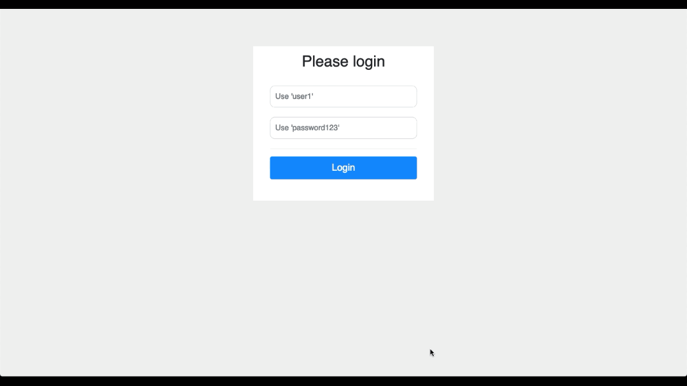

## Simple Spring Boot ReactJS outline Application with GraphQL, ReactJS, Spring Data JPA and Spring Security enabled 

## Table of Contents

- [Introduction](#introduction)
- [Building](#building)
- [Releasing](#releasing)
- [Login Credentials](#login-credentials)
- [GraphiQL](#graphiql)
- [Jenkins](#jenkins)
- [Terraform](#terraform)

#hello-3

### Introduction

This application is a lightweight Spring Boot and ReactJS outline application which can be used as the basis for your own apps.

This application serves the GUI using a GraphQL API and demonstrates idiomatic usage of GraphQL with entity 
GraphQLResolvers and GraphQL BatchLoaders that remove the N+1 issue by preloading data from the database 
that the entity GraphQLResolver will need later in the request.  The loaders are scoped to the *request*.

GraphQL Batching and DataLoaders : https://github.com/graphql-java/java-dataloader

### Building

Start the Spring Boot development server with hotreload as follows

```shell script
$ mvn clean spring-boot:run -P hotreload
```

Now start the React development server (in the same folder as the package.json) and browse to `http://localhost:3000` for hot-reload of the ReactJS app while you are developing
```shell script
$ cd src/main/frontend
$ npm install
$ npm start
```

You can now make code changes in ReactJS and Java and the code will be hot-reloaded into the running application

### Releasing

Once development is complete, simply run the following from the directory that contains `pom.xml` to create a release version of the application
```shell script
$ mvn clean install -P react
```

If you don't want to use Maven to build the release version of the ReactJS app run the following in the `frontend` directory and then run Maven separately
```shell script
$ cd src/main/frontend
$ npm run build
$ cd -
$ mvn clean install
```

You can now run the app using Java 11 or above as follows
```shell script
$ ${JAVA_HOME}/bin/java -jar target/spring-boot-react-0.0.1-SNAPSHOT.jar
```

### Login Credentials
These are the hard-coded credentials for this demo app and they can be found in `application.properties` Please change 
these in your version, preferably deleting them and enabling LDAP based authentication.
Got to localhost:9090 to login once you have started the application.

```text
Username : user1
Password : password123
```



### GraphiQL
There is a built in interactive interface for GraphQL that you can use during development for testing and debugging. 
The interface on your local run instance can be found at URL http://localhost:9090/graphiql


### Jenkins
Install Jenkins from jenkins.io ensuring that the Pipeline plugin is installed and configure with the [Jenkinsfile](https://www.jenkins.io/doc/book/pipeline/jenkinsfile/) in this repo

### Terraform

See the [README.md](terraform/README.md) in the terraform directory for instructions on how to deploy this sample project on AWS using Terraform

### AWS CDK

See the awscdk_typescript directory for deployment with AWS CDK which is a replacement for Terraform
